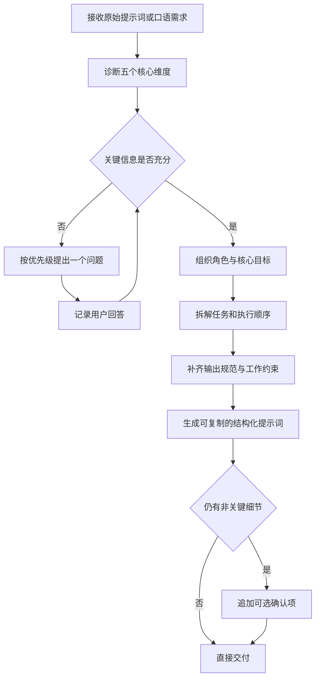

# Prompt Optimizer Skill

将模糊、口语化或结构松散的需求整理为角色清晰、任务分层、输出明确、约束完整的结构化提示词，适合交给 Claude、Codex 或其他智能体稳定执行复杂任务。

## 业务功能

| 功能 | 说明 |
| --- | --- |
| 提示词诊断 | 识别角色、目标、任务层次、输出格式、约束和协作方式中的缺口 |
| 关键澄清 | 按优先级一次确认一个会改变主体结构的问题 |
| 结构化重写 | 按角色、目标、任务、输出规范、约束和当前状态组织最终提示词 |
| 假设控制 | 对未确认信息使用占位符，不把推测包装成事实 |
| 复制交付 | 将优化结果放在独立代码块中，便于直接复用或继续迭代 |

优化框架围绕五个核心问题：`Who`、`What`、`How`、`Constraint` 和 `Interaction`。

## 使用场景

- 原始需求只有“分析、完善、优化”等笼统目标，执行结果经常偏题。
- 多个任务混在一段话里，需要建立先后顺序和阶段产物。
- 需要把口语化业务需求转换成可复制、可交接的智能体指令。
- 希望明确目标受众、输出格式、质量标准、禁止事项和确认机制。
- 已有提示词效果不稳定，需要定位缺失维度并做结构化改写。

简单、单一且边界清楚的任务无需套用完整模板，Skill 会按任务复杂度控制结构深度。

## 调用指令

优化现有提示词：

```text
$prompt-optimizer 帮我优化下面这段提示词：请分析这个项目并给我建议
```

把需求转为可执行指令：

```text
$prompt-optimizer 把这段口语化需求整理成可直接交给 Codex 执行的结构化提示词
```

指定交付偏好：

```text
$prompt-optimizer 保留原始目标，补齐验收标准和交互门禁，最终只输出一个 Markdown 代码块
```

当用户直接提供复杂、模糊的任务描述并要求整理为 prompt 时，Codex 也可以根据 `SKILL.md` 自动调用。

## 工作流程



## 业务价值

- **减少理解偏差**：明确角色、目标和边界，降低智能体猜测空间。
- **提高一次成功率**：把执行顺序、阶段产物和验收要求预先写清。
- **降低沟通轮次**：只追问真正影响结构的关键信息，避免一次抛出大量问题。
- **沉淀可复用资产**：将一次性口头需求转成可复制、可版本管理的提示词。
- **便于团队协作**：不同人员或不同模型使用同一指令时，输入和输出预期更一致。

## 安装

```text
$HOME/.agents/skills/prompt-optimizer/SKILL.md
```

项目级安装：

```text
<项目目录>/.agents/skills/prompt-optimizer/SKILL.md
```

## 仓库结构

| 路径 | 说明 |
| --- | --- |
| `SKILL.md` | 诊断流程、提问规则、输出模板和质量标准 |

## 相关文档

- [Skill 主说明](./SKILL.md)
- [OpenAI：Build skills](https://developers.openai.com/codex/skills)
