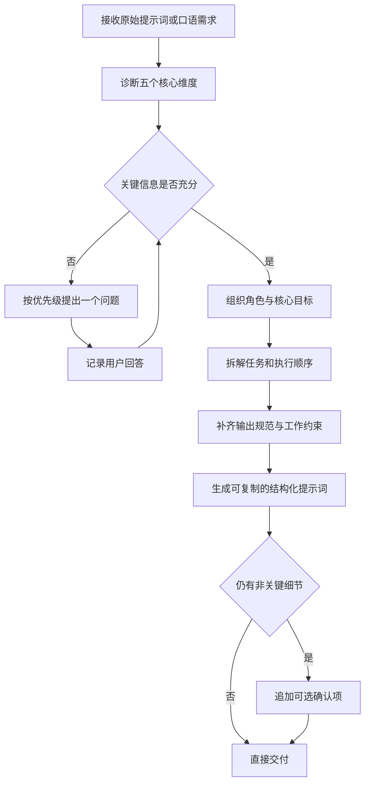

# Prompt Optimizer Skill

将模糊、口语化或结构松散的需求，整理为角色清晰、任务分层、输出明确、约束完整的结构化提示词，适合交给 Claude、Codex 或其他智能体稳定执行复杂任务。

> 核心能力：本 Skill 负责「提示词的结构化改造」，而不是替你完成目标业务任务。它保留你的原始意图，只补齐让智能体无需猜测就能执行所需的信息。

## 业务功能

优化框架围绕五个核心问题：`Who`（角色）、`What`（任务）、`How`（执行方式）、`Constraint`（约束）和 `Interaction`（协作方式）。

| 功能 | 说明 |
| --- | --- |
| 提示词诊断 | 识别角色、目标、任务层次、输出格式、约束和协作方式中的缺口 |
| 关键澄清 | 按优先级一次确认一个会改变主体结构的问题，不一次抛出一堆问题 |
| 结构化重写 | 按角色定义、核心目标、任务拆解、输出规范、工作约束和当前状态组织最终提示词 |
| 假设控制 | 对未确认信息使用占位符，不把推测包装成事实 |
| 复制交付 | 将优化结果放在独立代码块中，便于直接复用或继续迭代 |
| 复杂度自适应 | 简单任务不套完整模板，按任务复杂度控制结构深度，避免过度设计 |

五个核心问题的含义：

| 维度 | 要回答的问题 | 缺失时的典型后果 |
| --- | --- | --- |
| Who | 智能体扮演什么角色、具备什么专业背景 | 输出缺乏专业深度或越界发挥 |
| What | 核心任务是什么、拆成哪些子任务 | 目标笼统，执行结果偏题 |
| How | 执行顺序是什么、每步输出什么格式 | 产出结构混乱，难以验收 |
| Constraint | 边界条件、禁止事项、受众是什么 | 超出范围或违反业务约束 |
| Interaction | 遇到歧义是提问还是假设 | 臆造需求或反复返工 |

## 使用场景

- 原始需求只有「分析、完善、优化」等笼统目标，执行结果经常偏题。
- 多个任务混在一段话里，需要建立先后顺序和阶段产物。
- 需要把口语化业务需求转换成可复制、可交接的智能体指令。
- 希望明确目标受众、输出格式、质量标准、禁止事项和确认机制。
- 已有提示词效果不稳定，需要定位缺失维度并做结构化改写。
- 需要把同一段业务需求分别交付给不同模型或不同团队成员，保证输入输出预期一致。

简单、单一且边界清楚的任务无需套用完整模板，Skill 会按任务复杂度控制结构深度。

## 使用范例

### 范例一：把一段模糊需求改成结构化提示词

**优化前（用户原始输入）：**

> 你是一个高速公路养护专家，参考公路养护决策技术规范，完善甘肃公路养护决策系统的 prd 文档，补充整体的功能架构图和业务流程图，再逐个模块完善业务流程图和时序图，用于指导产品经理设计产品。在这期间有模糊不清的问题时随时向我提问。

**Skill 的诊断结果：**

- 角色背景笼统（未说明核心决策逻辑和知识边界）
- 目标模糊（「完善」未说明完善到什么程度）
- 任务顺序不清（架构图与流程图的关系、模块顺序未定义）
- 输出格式未说明（图用什么格式、文字如何组织）
- PRD 现状未知（从零开始还是有初稿）

**Skill 触发逐题澄清（一次只问一个）：**

```text
问题 1/3：这个 PRD 文档目前处于什么状态？
A. 从零开始，尚无初稿
B. 已有初稿，需要在现有基础上补充完善
C. 其他（请直接说明）
```

**优化后（结构化提示词，节选）：**

```markdown
# 角色定义
你是高速公路养护决策系统专家，熟悉《公路养护技术规范》等行业标准，
擅长养护决策逻辑建模与需求结构化表达。

# 核心目标
在现有 PRD 初稿基础上补充完善，产出可直接指导产品经理设计的版本化 PRD。

# 任务拆解（按优先级执行）
## 阶段一：整体架构梳理
1. 补全功能架构图（Mermaid）
2. 补全总体业务流程图（Mermaid）
...

# 输出规范
- 图表统一使用 Mermaid 语法，附 1-2 句文字说明
- 语言：中文

# 工作方式与约束
- 遇到歧义必须暂停并向我提问，不自行假设
- 每个阶段完成后停下等待确认，再进入下一阶段
```

### 范例二：简单任务不套完整模板

用户输入「把这段需求变成 prompt：帮我写一个周报总结」时，Skill 不会机械输出五段式模板，而是快速补上角色、输入、输出格式和语气即可，直接交付一个精简可用的指令。

## 调用指令

优化现有提示词：

```text
$prompt-optimizer 帮我优化下面这段提示词：请分析这个项目并给我建议
```

把需求转为可执行指令：

```text
$prompt-optimizer 把这段口语化需求整理成可直接交给 Codex 执行的结构化提示词
```

指定交付偏好：

```text
$prompt-optimizer 保留原始目标，补齐验收标准和交互门禁，最终只输出一个 Markdown 代码块
```

当用户直接提供复杂、模糊的任务描述并要求整理为 prompt 时，Codex 也可以根据 `SKILL.md` 自动调用。

## 工作流程



## 业务价值

- **减少理解偏差**：明确角色、目标和边界，把智能体的猜测空间降到最低。
- **提高一次成功率**：把执行顺序、阶段产物和验收要求预先写清，避免「第一次输出就偏题」。
- **降低沟通轮次**：只追问真正影响结构的关键信息，避免一次抛出大量问题压垮用户。
- **沉淀可复用资产**：将一次性口头需求转成可复制、可版本管理的提示词，形成团队提示词库。
- **便于团队协作**：不同人员或不同模型使用同一指令时，输入和输出预期更一致，减少口径漂移。
- **缩短上岗时间**：新成员或新模型拿到结构化提示词即可上手，无需反复口述背景。

## 安装

```text
$HOME/.agents/skills/prompt-optimizer/SKILL.md
```

项目级安装：

```text
<项目目录>/.agents/skills/prompt-optimizer/SKILL.md
```

## 仓库结构

| 路径 | 说明 |
| --- | --- |
| `SKILL.md` | 诊断流程、提问规则、输出模板和质量标准 |

## 相关文档

- [Skill 主说明](./SKILL.md)
- [OpenAI：Build skills](https://developers.openai.com/codex/skills)